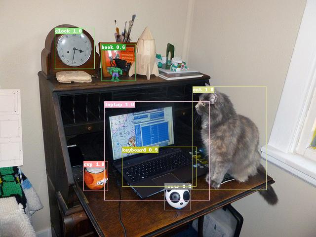

# Object detection and tracking
## Introduction to project
Detecting objects (images and videos) and tracking objects (videos). Given the input files, the program draws bounding boxes on the output files.

[Faster R-CNN](https://pytorch.org/vision/stable/models.html#torchvision.models.detection.fasterrcnn_resnet50_fpn) from torchvision module of PyTorch library is used for object detection. The model is pretrained on [COCO train2017](https://cocodataset.org/) dataset and detects classes from the `coco_classes.txt` file.

[SORT](https://arxiv.org/abs/1602.00763) algorithm and its [implementation](https://github.com/abewley/sort) by authors of the paper are used for tracking objects.

---
## Setting up environment
Required packages are listed in the `environment_conda.yml` file. Depending on your hardware, you may have to change `cudatoolkit` version according to [PyTorch installation guide](https://pytorch.org/get-started/locally/). Environment can be prepared with conda:
```
$ conda env create -f environment_conda.yml
```
You must also clone https://github.com/abewley/sort in the repository folder.
```
$ cd object-detection-and-tracking/
$ git clone https://github.com/abewley/sort
```
---
## Usage
Detecting objects in images where `images_dir` is folder with images. Resulting images will be saved in `images_dir/detections/`.
```
$ python main.py -i images_dir
```
Detecting objects in a video file. Output will be saved as `path/to/video.avi-detections.avi`.
```
$ python main.py -i path/to/video.avi
```
Tracking objects in a video file. Output will be saved as `path/to/video.avi-detections.avi`.
```
$ python main.py -i path/to/video.avi -t
```
---
## Examples
Object detection in an image from [COCO test2017](https://cocodataset.org/):



Object detection in a video: https://youtu.be/YGC5PtYbXKo. Original video: https://motchallenge.net/vis/TUD-Crossing.

Object tracking in a video: https://youtu.be/s5G9VWaOQfQ. Original video: https://motchallenge.net/vis/TUD-Stadtmitte.